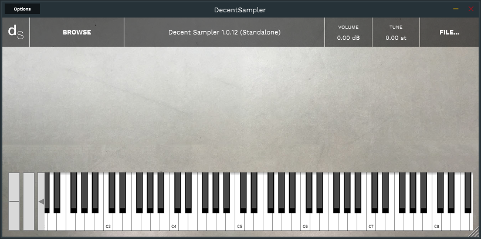

> Donations, tips, or a payment for a coffee are welcome [**PayPal**](https://www.paypal.com/paypalme/jorserp) 

# Decent Sampler Samples

I would like to share with you the samples I have done in my spare time, for the **Decent Sampler Plugin**

Hours and days investigating how to convert the sounds into a *Decent Sampler* file that I hope that helps

- [**`Korg X5D (20 Samples)`**](#korg_x5d)
- [**`Others (2 Samples)`**](#others)

# What is Decent Sampler?

If you don't know *what is Decent Sampler*, I have to say about it that is a free sampling plugin that allows you to play samples in the Decent Sampler format

The plugin is available for **Windows**, **Linux** and **MacOS**

There is a **Decent Sampler App** for [**iOS**](https://apps.apple.com/us/app/decent-sampler/id1530441977) too

And you can download it from here: [**Decent Sampler Plugin**](https://www.decentsamples.com/product/decent-sampler-plugin/)

# How is a Decent Sampler Sample?

The plugin can read **.dspreset** and **.dslibrary** files

A **.dslibrary** file is a *zip file* that contains the **.dspreset** file and the *.wav* files that needs as a package file

A **.dspreset** file is a *text file* in *XML format* with the sample details on it

You can find the **.dspreset** file format here: [**File Format Reference Guide**](https://www.decentsamples.com/wp-content/uploads/2020/06/format-documentation.html)

# How to use the Samples?

## Install Decent Sampler

1) Download the **Decent Sampler Plugin** and install it
2) Start **Decent Sampler** and configure it

## Use a sampler with Decent Sampler
1) Download the **.dslibrary** on your computer
2) Start **Decent Sampler**
3) Select **File... > Load** option and look for the **.dslibrary** file to load it

# About *My Samples*

I have prepared the Samples as **.dslibrary** because is easy to download and load from the **Decent Sampler**

Take in account that I am not responsible about these Samples and how you are going to use them

I am sharing these Samples for enjoy and learn how to use them with **Decent Sampler** 

# **Samples**

* [**Korg X5D**](Samples/Korg-X5D/Readme.md)
* [**Others**](Samples/Others/Readme.md)

# Other information

* [Korg X5D Information](Korg-X5D-Information.md)
