# **Korg X5D** *Decent Sampler Samples*

Here you will find the Samples for **Decent Sampler**

[Main Page](../../README.md)

## **Samples**
- [`12 Strings`](#12_strings)
- [`Accordeon`](#accordeon)
- [`Chorus Guitar`](#chorus_guitar)
- [`Digipiano`](#digipiano)
- [`Fat Pianos`](#fat_pianos)
- [`Guitarman`](#guitarman)
- [`Harpsicord`](#harpsicord)
- [`Ice Bells`](#ice_bells)
- [`Java Bells`](#java_bells)
- [`Malguea`](#malguea)
- [`Moonstone`](#moonstone)
- [`Neurofunk`](#neurofunk)
- [`Rezzofunky`](#rezzofunky)
- [`Rock Piano`](#rock_piano)
- [`Stereo Keys`](#stereo_keys)
- [`Super EP`](#super_ep)
- [`Super Keys`](#super_keys)
- [`Velo Roads`](#velo_roads)
- [`Warm Koto`](#warm_koto)
- [`X-Brass`](#x_brass)
- [`Zen Garden`](#zen_garden)

## **12 Strings**

[**Korg X5D - 12 Strings (2.88 Mb)**](DS/Korg%20X5D%20-%2012%20Strings.dslibrary)

## **Accordeon**

[**Korg X5D - Accordeon (7.68 Mb)**](DS/Korg%20X5D%20-%20Accordeon.dslibrary)

## **Analog King**

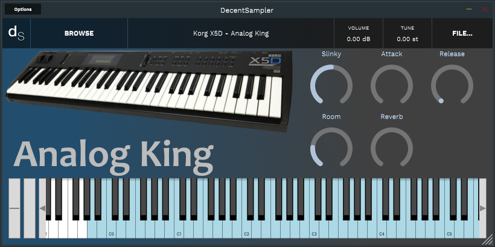

[**Korg X5D - Analog King (9.22 Mb)**](DS/Korg%20X5D%20-%20Analog%20King.dslibrary)

## **Ancient Sun**

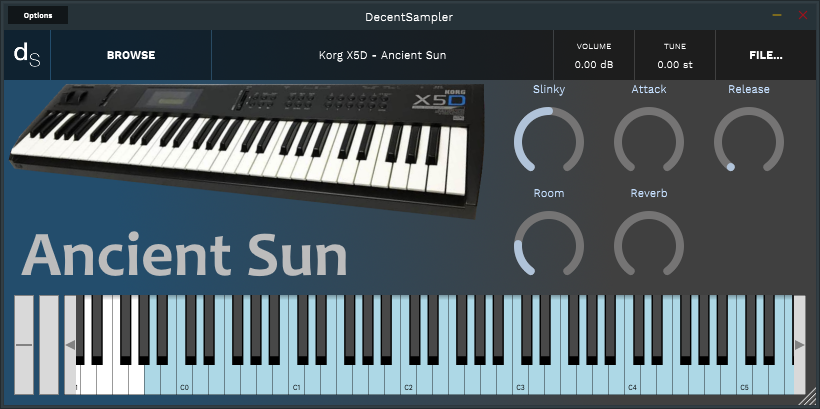

[**Korg X5D - Ancient Sun (7.99 Mb)**](DS/Korg%20X5D%20-%20Ancient%20Sun.dslibrary)

## **Ariana**

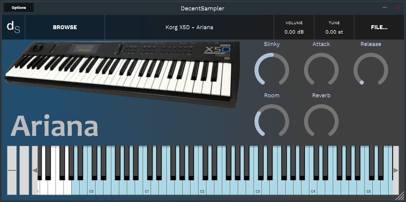

[**Korg X5D - Ariana (8.07 Mb)**](DS/Korg%20X5D%20-%20Ariana.dslibrary)

## **Bass+Horn**

[**Korg X5D - Bass+Horn (2.99 Mb)**](DS/Korg%20X5D%20-%20Bass+Horn.dslibrary)

## **Big Band**

[**Korg X5D - Big Band (8.88 Mb)**](DS/Korg%20X5D%20-%20Big%20Band.dslibrary)

## **Bigswell**

[**Korg X5D - Bigswell (8.59 Mb)**](DS/Korg%20X5D%20-%20Bigswell.dslibrary)

## **Brass Swell**

[**Korg X5D - Brass Swell (7.34 Mb)**](DS/Korg%20X5D%20-%20Brass%20Swell.dslibrary)

## **Cafedral**

[**Korg X5D - Cafedral (6.85 Mb)**](DS/Korg%20X5D%20-%20Cafedral.dslibrary)

## **Chorus Guitar**

[**Korg X5D - Chorus Guitar (4.24 Mb)**](DS/Korg%20X5D%20-%20Chorus%20Guitar.dslibrary)

## **Crank It Up**

[**Korg X5D - Crank It Up (7.85 Mb)**](DS/Korg%20X5D%20-%20Crank%20It%20Up.dslibrary)

## **Crossfades**

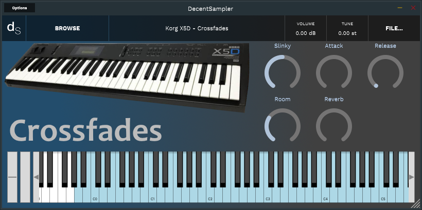

[**Korg X5D - Crossfades (7.92 Mb)**](DS/Korg%20X5D%20-%20Crossfades.dslibrary)

## **Digipiano**

[**Korg X5D - Digipiano (6.54 Mb)**](DS/Korg%20X5D%20-%20Digipiano.dslibrary)

## **East Africa**

[**Korg X5D - East Africa (6.92 Mb)**](DS/Korg%20X5D%20-%20East%20Africa.dslibrary)

## **Etnicorch**

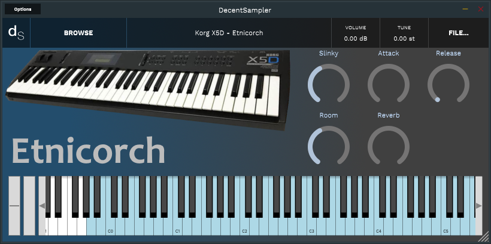

[**Korg X5D - Etnicorch (8.99 Mb)**](DS/Korg%20X5D%20-%20Etnicorch.dslibrary)

## **Fanfare**

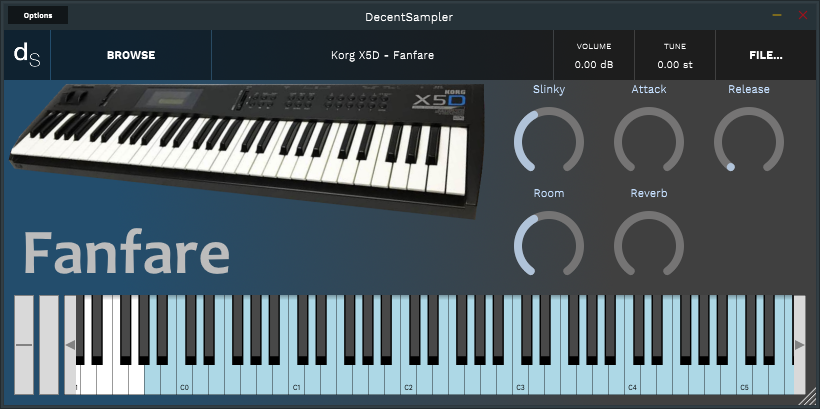

[**Korg X5D - Fanfare (8.73 Mb)**](DS/Korg%20X5D%20-%20Fanfare.dslibrary)

## **Fat Pianos**

[**Korg X5D - Fat Pianos (6.83 Mb)**](DS/Korg%20X5D%20-%20Fat%20Pianos.dslibrary)

## **Full Strings**

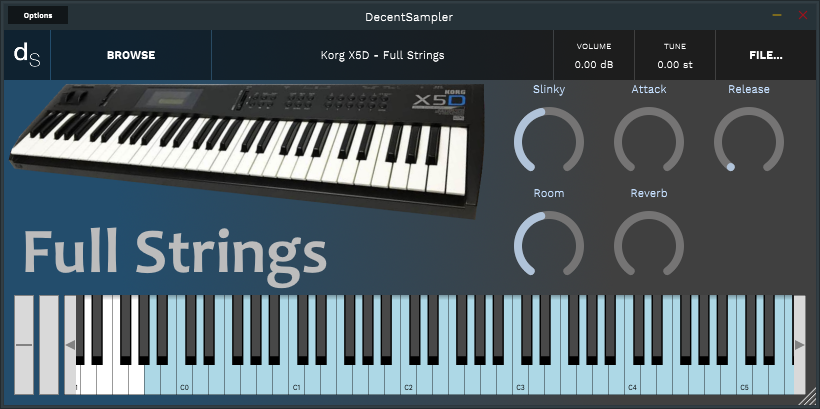

[**Korg X5D - Full Strings (9.32 Mb)**](DS/Korg%20X5D%20-%20Full%20Strings.dslibrary)

## **Guitarman**

[**Korg X5D - Guitarman (7.4 Mb)**](DS/Korg%20X5D%20-%20Guitarman.dslibrary)

## **Harpsicord**

[**Korg X5D - Harpsicord (3.03 Mb)**](DS/Korg%20X5D%20-%20Harpsicord.dslibrary)

## **Headhunter**

[**Korg X5D - Headhunter (8.56 Mb)**](DS/Korg%20X5D%20-%20Headhunter.dslibrary)

## **Ice Bells**

[**Korg X5D - Ice Bells (3.64 Mb)**](DS/Korg%20X5D%20-%20Ice%20Bells.dslibrary)

## **Java Bells**

[**Korg X5D - Java Bells (3.13 Mb)**](DS/Korg%20X5D%20-%20Java%20Bells.dslibrary)

## **Layersynth**

[**Korg X5D - Layersynth (8.48 Mb)**](DS/Korg%20X5D%20-%20Layersynth.dslibrary)

## **Lunar Bells**

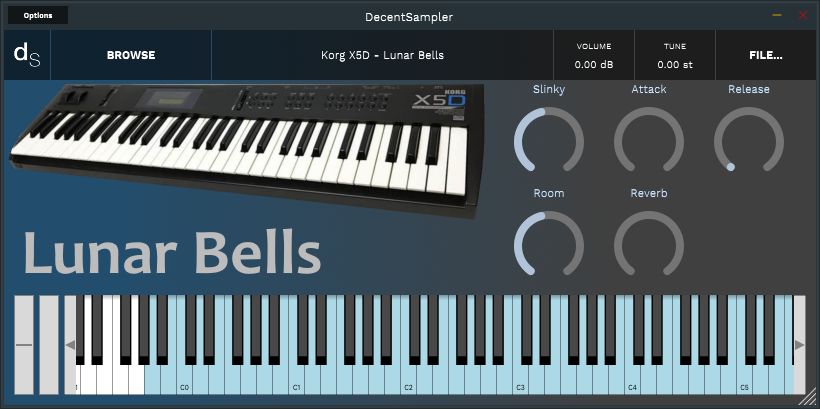

[**Korg X5D - Lunar Bells (7.58 Mb)**](DS/Korg%20X5D%20-%20Lunar%20Bells.dslibrary)

## **Malguea**

[**Korg X5D - Malguea (3.33 Mb)**](DS/Korg%20X5D%20-%20Malguea.dslibrary)

## **Maxi Stab**

[**Korg X5D - Maxi Stab (7.20 Mb)**](DS/Korg%20X5D%20-%20Maxi%20Stab.dslibrary)

## **Megatron**

[**Korg X5D - Megatron (8.62 Mb)**](DS/Korg%20X5D%20-%20Megatron.dslibrary)

## **Moonstone**

[**Korg X5D - Moonstone (8.05 Mb)**](DS/Korg%20X5D%20-%20Moonstone.dslibrary)

## **Multirez**

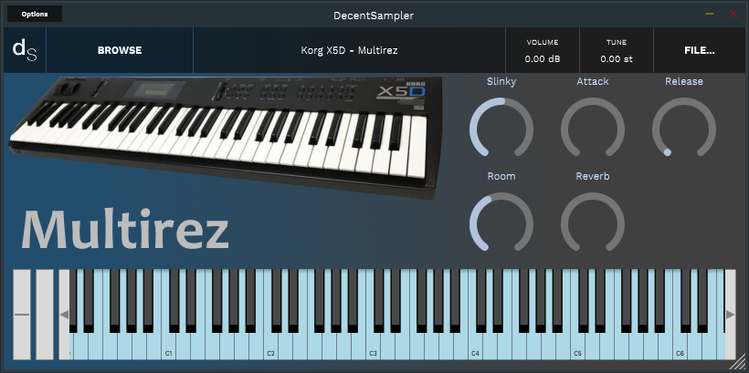

[**Korg X5D - Multirez (8.77 Mb)**](DS/Korg%20X5D%20-%20Multirez.dslibrary)

## **Muted Horns**

[**Korg X5D - Muted Horns (7.81 Mb)**](DS/Korg%20X5D%20-%20Muted%20Horns.dslibrary)

## **Neurofunk**

[**Korg X5D - Neurofunk (5.81 Mb)**](DS/Korg%20X5D%20-%20Neurofunk.dslibrary)

## **Newworlds**

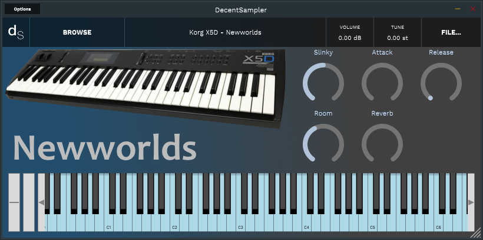

[**Korg X5D - Newworlds (12.7 Mb)**](DS/Korg%20X5D%20-%20Newworlds.dslibrary)

## **Phantom Sax**

[**Korg X5D - Phantom Sax (6.42 Mb)**](DS/Korg%20X5D%20-%20Phantom%20Sax.dslibrary)

## **Pizzo**

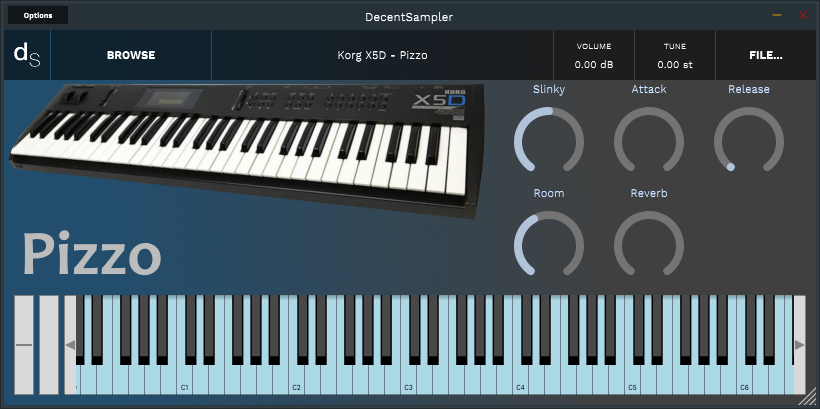

[**Korg X5D - Pizzo (8.03 Mb)**](DS/Korg%20X5D%20-%20Pizzo.dslibrary)

## **Rezzofunky**

[**Korg X5D - Rezzofunky (4.77 Mb)**](DS/Korg%20X5D%20-%20Rezzofunky.dslibrary)

## **Rock Organ**

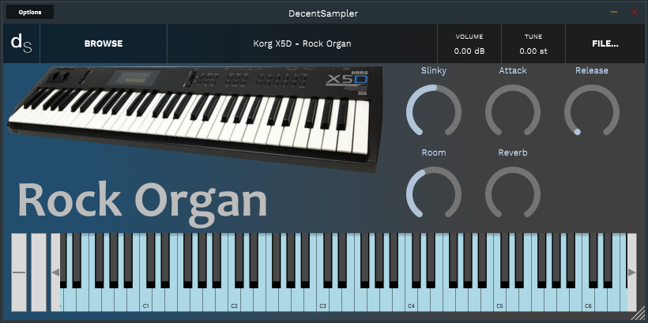

[**Korg X5D - Rock Organ (5.03 Mb)**](DS/Korg%20X5D%20-%20Rock%20Organ.dslibrary)

## **Rock Piano**

[**Korg X5D - Rock Piano (5.39 Mb)**](DS/Korg%20X5D%20-%20Rock%20Piano.dslibrary)

## **Solar Flare**

[**Korg X5D - Solar Flare (9.09 Mb)**](DS/Korg%20X5D%20-%20Solar%20Flare.dslibrary)

## **Stereo Keys**

[**Korg X5D - Stereo Keys (3.96 Mb)**](DS/Korg%20X5D%20-%20Stereo%20Keys.dslibrary)

## **Super EP**

[**Korg X5D - Super EP (4.19 Mb)**](DS/Korg%20X5D%20-%20Super%20EP.dslibrary)

## **Super Keys**

[**Korg X5D - Super Keys (8.92 Mb)**](DS/Korg%20X5D%20-%20Super%20Keys.dslibrary)

## **Symphony**

[**Korg X5D - Symphony (8.41 Mb)**](DS/Korg%20X5D%20-%20Symphony.dslibrary)

## **The East**

[**Korg X5D - The East (8.14 Mb)**](DS/Korg%20X5D%20-%20The%20East.dslibrary)

## **The Saxman**

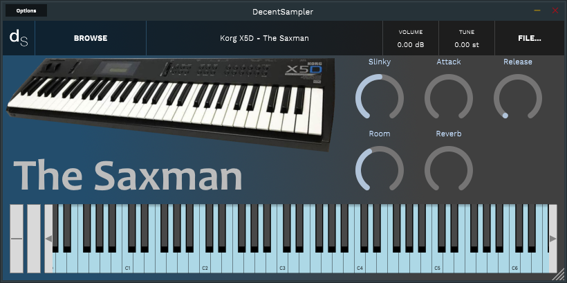

[**Korg X5D - The Saxman (5.95 Mb)**](DS/Korg%20X5D%20-%20The%20Saxman.dslibrary)

## **The Singers**

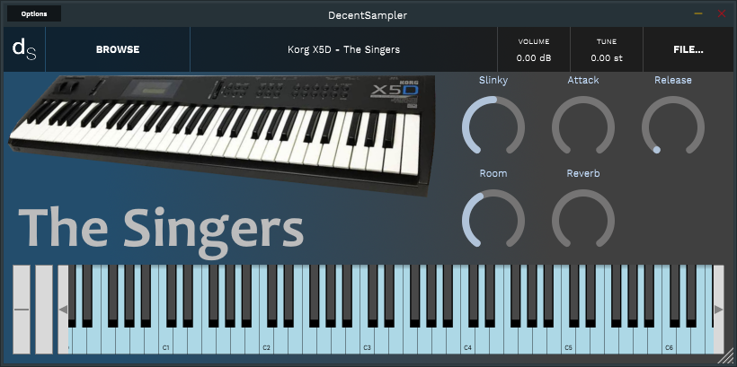

[**Korg X5D - The Singers (6.58 Mb)**](DS/Korg%20X5D%20-%20The%20Singers.dslibrary)

## **The West**

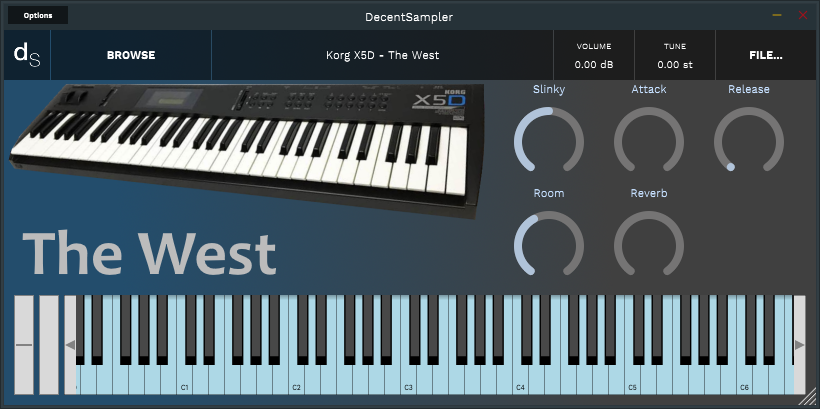

[**Korg X5D - The West (6.70 Mb)**](DS/Korg%20X5D%20-%20The%20West.dslibrary)

## **Torquemada**

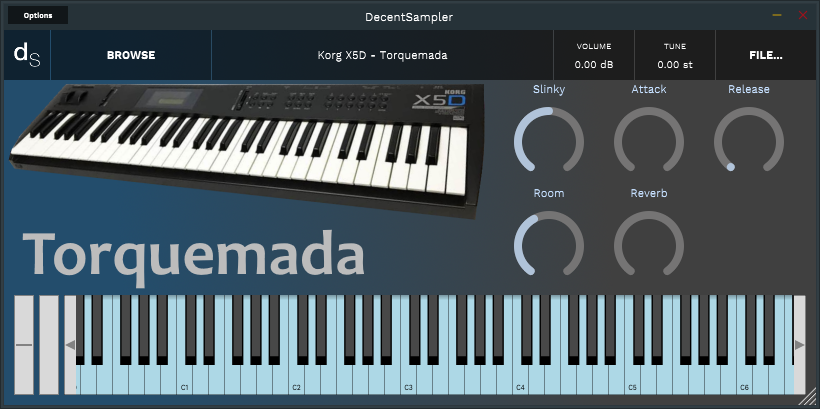

[**Korg X5D - Torquemada (7.36 Mb)**](DS/Korg%20X5D%20-%20Torquemada.dslibrary)

## **Ultraperc**

[**Korg X5D - Ultraperc (6.42 Mb)**](DS/Korg%20X5D%20-%20Ultraperc.dslibrary)

## **Velo Roads**

[**Korg X5D - Velo Roads (3.67 Mb)**](DS/Korg%20X5D%20-%20Velo%20Roads.dslibrary)

## **Warm Koto**

[**Korg X5D - Warm Koto (1.94 Mb)**](DS/Korg%20X5D%20-%20Warm%20Koto.dslibrary)

## **Warriors**

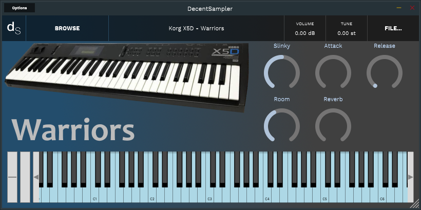

[**Korg X5D - Warriors (8.64 Mb)**](DS/Korg%20X5D%20-%20Warriors.dslibrary)

## **Wave Guitar**

[**Korg X5D - Wave Guitar (8.32 Mb)**](DS/Korg%20X5D%20-%20Wave%20Guitar.dslibrary)

## **Wind Orch**

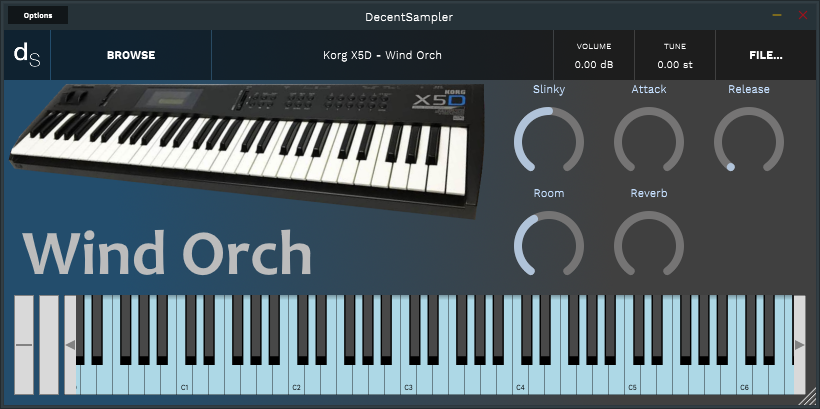

[**Korg X5D - Wind Orch (7.32 Mb)**](DS/Korg%20X5D%20-%20Wind%20Orch.dslibrary)

## **X-Brass**

[**Korg X5D - X-Brass (6.77 Mb)**](DS/Korg%20X5D%20-%20X-Brass.dslibrary)

## **X-Strings**

[**Korg X5D - X-Strings (9.02 Mb)**](DS/Korg%20X5D%20-%20X-Strings.dslibrary)

## **Zen Garden**

[**Korg X5D - Zen Garden (2.86 Mb)**](DS/Korg%20X5D%20-%20Zen%20Garden.dslibrary)

--- 
[`Go Up`](#home)
