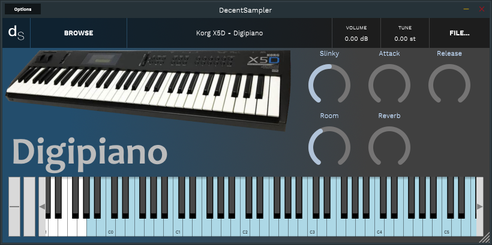
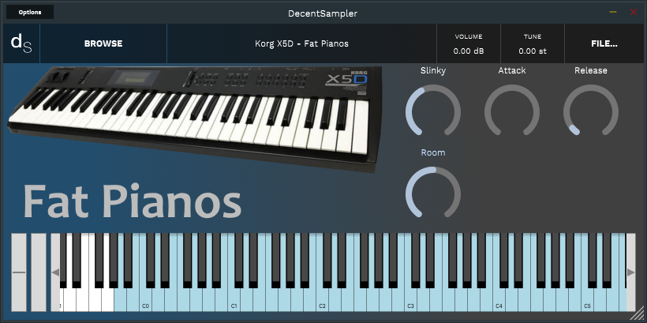
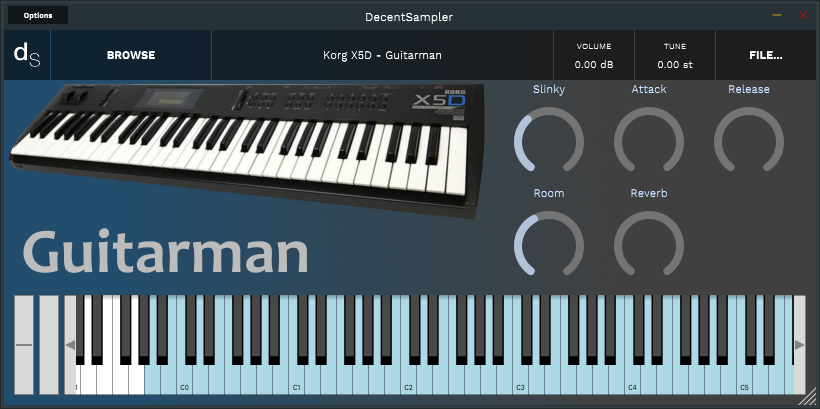
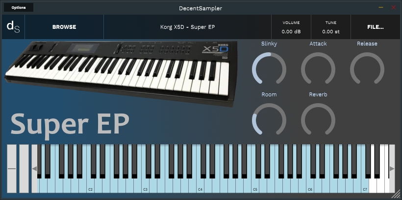
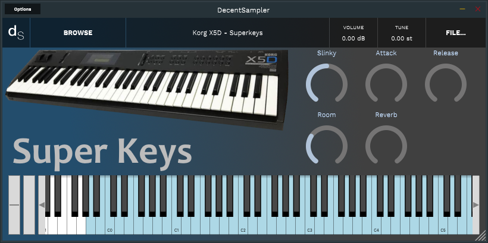
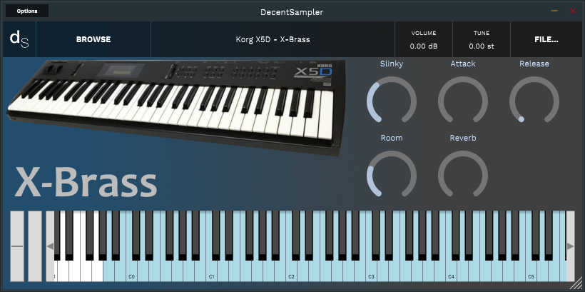
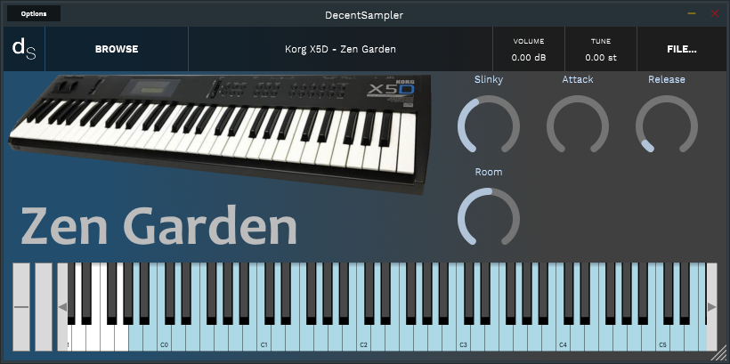

# **Korg X5D** *Decent Sampler Samples*

Here you will find the Samples for **Decent Sampler**

[Main Page](../../README.md)

## **Samples**
- [`12 Strings`](#12_strings)
- [`Chorus Guitar`](#chorus_guitar)
- [`Digipiano`](#digipiano)
- [`Fat Pianos`](#fat_pianos)
- [`Guitarman`](#guitarman)
- [`Harpsicord`](#harpsicord)
- [`Ice Bells`](#ice_bells)
- [`Java Bells`](#java_bells)
- [`Malguea`](#malguea)
- [`Moonstone`](#moonstone)
- [`Neurofunk`](#neurofunk)
- [`Rezzofunky`](#rezzofunky)
- [`Rock Piano`](#rock_piano)
- [`Stereo Keys`](#stereo_keys)
- [`Super EP`](#super_ep)
- [`Super Keys`](#super_keys)
- [`Velo Roads`](#velo_roads)
- [`Warm Koto`](#warm_koto)
- [`X-Brass`](#x_brass)
- [`Zen Garden`](#zen_garden)

## **12 Strings**

[**Korg X5D - 12 Strings (2.88 Mb)**](Samples/Korg%20X5D%20-%2012%20Strings.dslibrary)

## **Chorus Guitar**

[**Korg X5D - Chorus Guitar (4.24 Mb)**](Samples/Korg%20X5D%20-%20Chorus%20Guitar.dslibrary)

## **Digipiano**

[**Korg X5D - Digipiano (6.54 Mb)**](Samples/Korg%20X5D%20-%20Digipiano.dslibrary)

## **Fat Pianos**

[**Korg X5D - Fat Pianos (6.83 Mb)**](Samples/Korg%20X5D%20-%20Fat%20Pianos.dslibrary)

## **Guitarman**

[**Korg X5D - Guitarman (7.4 Mb)**](Samples/Korg%20X5D%20-%20Guitarman.dslibrary)

## **Harpsicord**

[**Korg X5D - Harpsicord (3.03 Mb)**](Samples/Korg%20X5D%20-%20Harpsicord.dslibrary)

## **Ice Bells**

[**Korg X5D - Ice Bells (3.64 Mb)**](Samples/Korg%20X5D%20-%20Ice%20Bells.dslibrary)

## **Java Bells**

[**Korg X5D - Java Bells (3.13 Mb)**](Samples/Korg%20X5D%20-%20Java%20Bells.dslibrary)

## **Malguea**

[**Korg X5D - Malguea (3.33 Mb)**](Samples/Korg%20X5D%20-%20Malguea.dslibrary)

## **Moonstone**

[**Korg X5D - Moonstone (8.05 Mb)**](Samples/Korg%20X5D%20-%20Moonstone.dslibrary)

## **Neurofunk**

[**Korg X5D - Neurofunk (5.81 Mb)**](Samples/Korg%20X5D%20-%20Neurofunk.dslibrary)

## **Rezzofunky**

[**Korg X5D - Rezzofunky (4.77 Mb)**](Samples/Korg%20X5D%20-%20Rezzofunky.dslibrary)

## **Rock Piano**

[**Korg X5D - Rock Piano (5.39 Mb)**](Samples/Korg%20X5D%20-%20Rock%20Piano.dslibrary)

## **Stereo Keys**

[**Korg X5D - Stereo Keys (3.96 Mb)**](Samples/Korg%20X5D%20-%20Stereo%20Keys.dslibrary)

## **Super EP**

[**Korg X5D - Super EP (4.19 Mb)**](Samples/Korg%20X5D%20-%20Super%20EP.dslibrary)

## **Super Keys**

[**Korg X5D - Super Keys (8.92 Mb)**](Samples/Korg%20X5D%20-%20Super%20Keys.dslibrary)

## **Velo Roads**

[**Korg X5D - Velo Roads (3.67 Mb)**](Samples/Korg%20X5D%20-%20Velo%20Roads.dslibrary)

## **Warm Koto**

[**Korg X5D - Warm Koto (1.94 Mb)**](Samples/Korg%20X5D%20-%20Warm%20Koto.dslibrary)

## **X-Brass**

[**Korg X5D - X-Brass (6.77 Mb)**](Samples/Korg%20X5D%20-%20X-Brass.dslibrary)

## **Zen Garden**

[**Korg X5D - Zen Garden (2.86 Mb)**](Samples/Korg%20X5D%20-%20Zen%20Garden.dslibrary)

--- 
[`Go Up`](#home)
