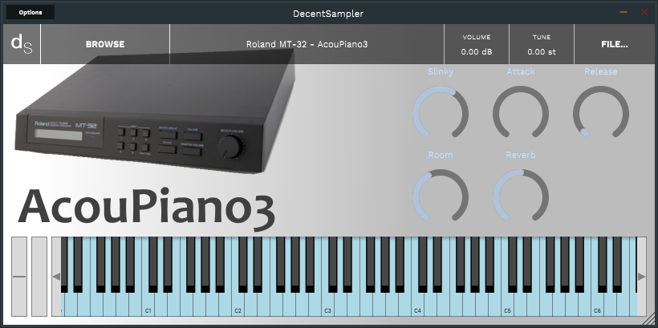
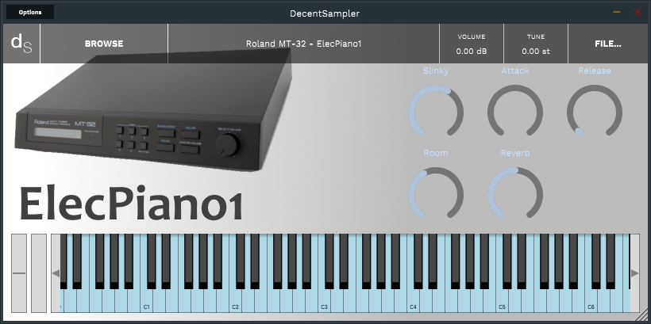

# **Roland MT-32** *Decent Sampler Samples*

Here you will find the Samples for **Decent Sampler**

[Main Page](../../README.md)

## **Samples**
- [`AcouPiano1`](#acoupiano1)
- [`AcouPiano2`](#acoupiano2)
- [`AcouPiano3`](#acoupiano3)
- [`ElecPiano1`](#elecpiano1)
- [`ElecPiano2`](#elecpiano2)
- [`ElecPiano3`](#elecpiano3)
- [`ElecPiano4`](#elecpiano4)

## **AcouPiano1**

[**Roland MT-32 - AcouPiano1 (1.00 Mb)**](DS/Roland%20MT-32%20-%20AcouPiano1.dslibrary)

## **AcouPiano2**

[**Roland MT-32 - AcouPiano2 (768 Kb)**](DS/Roland%20MT-32%20-%20AcouPiano2.dslibrary)

## **AcouPiano3**

[**Roland MT-32 - AcouPiano3 (920 Kb)**](DS/Roland%20MT-32%20-%20AcouPiano3.dslibrary)

## **ElecPiano1**

[**Roland MT-32 - ElecPiano1 (2.81 Mb)**](DS/Roland%20MT-32%20-%20ElecPiano1.dslibrary)

## **ElecPiano2**

[**Roland MT-32 - ElecPiano2 (2.19 Mb)**](DS/Roland%20MT-32%20-%20ElecPiano2.dslibrary)

## **ElecPiano3**

[**Roland MT-32 - ElecPiano3 (2.66 Mb)**](DS/Roland%20MT-32%20-%20ElecPiano3.dslibrary)

## **ElecPiano4**

[**Roland MT-32 - ElecPiano4 (744 Kb)**](DS/Roland%20MT-32%20-%20ElecPiano4.dslibrary)

--- 
[`Go Up`](#home)
